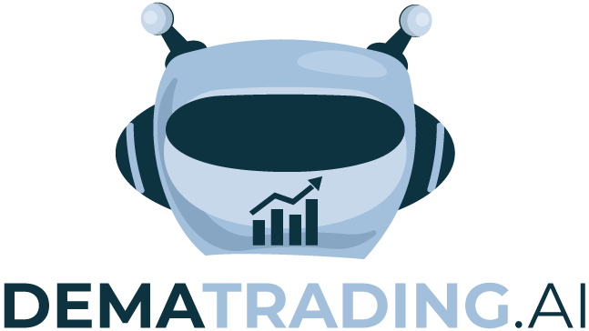
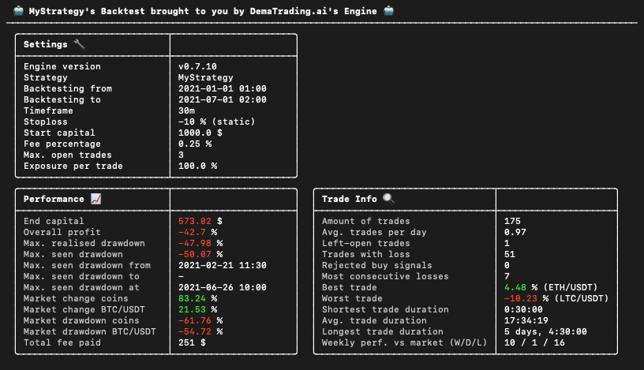
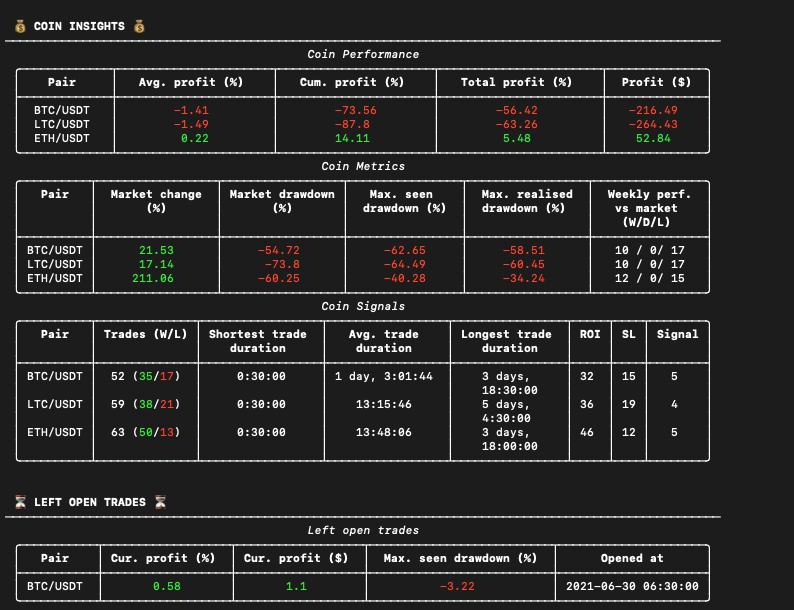

[](https://www.codacy.com/gh/dema-trading-ai/engine/dashboard?utm_source=github.com&amp;utm_medium=referral&amp;utm_content=dema-trading-ai/engine&amp;utm_campaign=Badge_Grade)
[](https://github.com/dema-trading-ai/engine)
[](https://github.com/dema-trading-ai/engine)
[](https://github.com/dema-trading-ai/engine)
[](https://github.com/dema-trading-ai/engine/actions/workflows/PR-Push-test.yml)

<p align="center">
  
</p>

# Engine
The DemaTrading.ai Engine is an open source backtesting Engine for cryptocurrency bot trading as a 
part of [DemaTrading](https://dematrading.ai/). The Engine is completely written in the 
programming language Python. Some experience with Python makes this process easier, 
however with some effort this project should be runnable for everyone, no matter your experience with coding.

##### [Go to the full documentation](https://docs.dematrading.ai)






# Discord

For any questions not covered by the documentation, or for further questions regarding the Engine, 
trading, your own strategies, your algorithms, or just a chit chat with like-minded individuals, 
you are more than welcome join our Discord server, where we will facilitate whatever need you 
may have.

##### [Join Discord server](https://dematrading.io/discord)


# Installing

If you want to install the Engine, all you have to do is to run a single command in your terminal. Based on which operating system you are using, you follow the instructions below.

For more detailed instructions, see the [full documentation](https://docs.dematrading.ai).

## Installing on MacOS

If your operating system is macOS, please execute the following command from a terminal:

```
curl -fsSL https://engine-store.ams3.digitaloceanspaces.com/installing_macos.sh | /bin/bash
```

## Installing on Windows

If your operating system is Windows, please execute the following command from a terminal:

```
Set-ExecutionPolicy Bypass -Scope Process -Force; iex ((New-Object System.Net.WebClient).DownloadString('https://ams3.digitaloceanspaces.com/engine-store/install-windows.ps1'))
```

# Running the Engine

Once you have successfully installed the Engine, it is time to run it. Open a terminal (MacOS) or Powershell (with administrator rights) (Windows), and execute the following commands.

To create your project in a new folder, use the following command:

```
engine init <YOUR_DIRECTORY_NAME>
```
Move to the directory you just created with the following command:

```
cd <YOUR_DIRECTORY_NAME>
```
Then, to run the Engine, simply execute the following command:
```
engine
```


# Developing
To start developing your very own strategy, we suggest reading our [docs](https://docs.dematrading.ai/getting_started/strategies/strategyexamples/) 
for more information.
> To give you a headstart, we included a sample strategy which can be found in 
/resources/setup/strategies/my_strategy.py

If you want to create your own strategy just simply copy the sample strategy and change the name 
of the class to for example 'MyNewStrategy'. Then just change the config.json file in the Engine 
directory accordingly to test this strategy:
```
"strategy-name": "MyNewStrategy"
```

For feature requests or suggestions, please write a message in our [Discord](https://discord.gg/WXxjtNzjEx) 
under #engine-support.


#### Installing Code Editor
To make your a life a lot easier during strategy development use a code editor such as [PyCharm](https://www.jetbrains.com/pycharm/) 
(recommended) or [VSCode](https://code.visualstudio.com/).


# License
This project is licensed under AGPL-3.0 License. It is not allowed to use this project to run any live trading instances. This project is for strategy testing only, if you want to monetise your strategy you can contact us. We can also help you to optimise your strategy. Any questions regarding this project? Feel free to get in touch using the contactform at https://DemaTrading.ai. 


